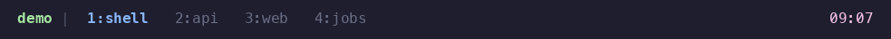

# tmux-agent-state

Agent state on your tmux window tabs, for people who already live in tmux and
run coding agents in it.



Every window that runs an agent gets a marker on its tab:

| Tab | State | Meaning |
|---|---|---|
| `3:api ~` (yellow) | working | the agent runs a turn |
| `3:api !` (whole tab red, bold) | blocked | the agent needs you: a permission prompt, a question, or an error |
| `3:api ✓` (green) | done | the agent finished its turn |
| `3:api` | idle | nothing to see |

The pane's bell also rings on `blocked` and `done`, so your terminal's bell
handling (badge, notification, tmux `monitor-bell`) keeps working. Look at a
`done` window and the plugin acknowledges it, the same way tmux clears a bell
flag. For a desktop notification, connect your own notifier: see
[Notify](#notify).

State comes from the agent's own lifecycle events. The plugin does not read
the screen. `blocked` fires on the actual permission prompt. And one key,
`prefix` + `a`, goes straight to whatever needs you: see
[Triage](#triage-go-to-whatever-needs-you).

Requires tmux >= 3.2.

## Install

Two steps. They are the same for every agent.

### 1. The tmux plugin

Add this line to `.tmux.conf`, then press `prefix` + `I`:

```tmux
set -g @plugin 'cburmeister/tmux-agent-state'
```

Works with [tpack](https://github.com/tmuxpack/tpack) and
[TPM](https://github.com/tmux-plugins/tpm). This sets up the tab rendering and
the acknowledge behaviour. It knows nothing about agents yet.

### 2. Your agent's adapter

The adapter tells the tmux plugin what the agent does. Install the one for
the agent you run.

#### Claude Code

```bash
claude plugin marketplace add cburmeister/tmux-agent-state
claude plugin install tmux-agent-state@cburmeister
```

You get the full tab: `~` while it works, `!` when it needs you, `✓` when it
finishes. New sessions pick it up immediately; running sessions need
`/reload-plugins`; `claude --bare` skips plugins, so bare sessions do not
report. Claude Code pointed at another model (`ANTHROPIC_BASE_URL`, Ollama,
...) works exactly the same, because the hooks are Claude Code's, not the
model's.

#### Codex CLI

Add one `notify` line to `~/.codex/config.toml`; it is in
[adapters/codex/](adapters/codex/).

You get the `✓` and the bell when a turn finishes. You do not get `~` or `!`,
because Codex fires no external event while it works or waits for approval.

#### Gemini CLI

Merge [adapters/gemini/settings-hooks.json](adapters/gemini/settings-hooks.json)
into `~/.gemini/settings.json`; details in [adapters/gemini/](adapters/gemini/).

You get the full tab: `~`, `!`, and `✓`.

#### OpenCode

Copy [tmux-agent-state.js](adapters/opencode/tmux-agent-state.js) into
`~/.config/opencode/plugins/`; details in
[adapters/opencode/](adapters/opencode/).

You get the full tab: `~`, `!`, and `✓`.

#### pi

```bash
pi install git:github.com/cburmeister/tmux-agent-state
```

You get `~` while it works and `✓` when it settles. You do not get `!`,
because pi fires no event for its confirmation prompts.

#### Qwen Code

Merge [adapters/qwen/settings-hooks.json](adapters/qwen/settings-hooks.json)
into `~/.qwen/settings.json`; details in [adapters/qwen/](adapters/qwen/).

You get the full tab: `~`, `!`, and `✓`.

#### Copilot CLI

Copy [hooks.json](adapters/copilot/hooks.json) into `~/.copilot/hooks/`;
details in [adapters/copilot/](adapters/copilot/).

You get the full tab: `~`, `!`, and `✓`.

#### goose

Copy [hooks.json](adapters/goose/hooks.json) into
`~/.agents/plugins/tmux-agent-state/hooks/`; details in
[adapters/goose/](adapters/goose/).

You get `~` while it works and `✓` when it finishes. You do not get `!`,
because goose fires no event for its approval prompts.

#### Amp

Copy [tmux-agent-state.ts](adapters/amp/tmux-agent-state.ts) into
`~/.config/amp/plugins/`; details in [adapters/amp/](adapters/amp/).

You get `~` while it works and `✓` when it finishes. You do not get `!`,
because Amp fires no event for its approval prompts.

#### Cursor CLI

Not possible yet: its hooks fire in the IDE, and `cursor-agent` exposes no
lifecycle events.

Run more than one agent? Install more than one adapter. The tabs do not care
which is which. Every adapter is a thin mapping from that agent's events onto
the same six-word vocabulary: the four states above, plus `remind` (re-ring
the bell) and `clear` (a session ended).
[adapters/README.md](adapters/README.md) has the contract if yours is missing,
and [CONTRIBUTING.md](CONTRIBUTING.md) explains how to send it back.

## How it works

`scripts/agent-state.sh` takes one word. Four are the states from the table at
the top (`idle`, `working`, `blocked`, `done`) and are stored in a tmux pane
option, `@agent_state`; `remind` re-rings the bell, and `clear` removes the
state when a session ends. Two things render the stored state:

- The window tab shows the worst state across the window's panes. `blocked`
  beats `working` beats `done`. Two agents in one window cannot overwrite each
  other's tab. The tab answers one question: does this window need me?
- Each agent pane's border takes its own state's colour. Once you are in the
  window, you can see which pane is which.

The tmux plugin runs the script's `setup` at tmux startup. Setup appends the
tab marker to your `window-status-format` and `window-status-current-format`
(your theme is untouched; the marker is a suffix). It adds a
`session-window-changed` hook, binds the triage key, and publishes the
script's location as `@agent_state_script`. Every edit is content-checked: it
happens once, and it heals itself after a config reload.

Visit a window to acknowledge it: `done` panes go back to `idle`, panes that
no longer run an agent lose their state, `working` and `blocked` panes stay as
they are.

An adapter maps the agent's lifecycle events to those six words and calls the
script. That is the whole contract; [adapters/README.md](adapters/README.md)
lists every mapping. The Claude Code adapter is a Claude Code plugin
(`.claude-plugin/`, `hooks/hooks.json`). It lives at the repo root because the
plugin format requires that.

If an adapter runs before the tmux plugin has (or you skipped step 1), the
script performs setup itself on its first call. Nothing breaks; you just did
not choose when it happened. An update takes effect in the running tmux server
on its next event: a newer copy of the script replaces what an older one set
up. You do not restart tmux.

## Triage: go to whatever needs you

`prefix` + `a` is bound for you at install. It goes straight to the agent that
most needs you: `blocked` before `done`, and among those, the one that has
waited longest. Press it again to step to the next one; the pane you are in
is skipped, so repeated presses walk through everything that needs you. No
menu, no popup, nothing to read. If nothing needs you, it says so and stays
put.

Panes are matched with the same test the tabs use, so the key and the tab bar
can never disagree. It crosses sessions.

## Options

Set these in `.tmux.conf`. A change takes effect on the next agent event; you
do not restart tmux.

### Glyphs and colours

One option per state. The style is used everywhere that state is drawn: the
tab glyph, the whole-tab style, and the pane border. Any tmux style works;
separate attributes with spaces.

| Option | Default |
|---|---|
| `@agent_state_glyph_blocked` | `!` |
| `@agent_state_glyph_working` | `~` |
| `@agent_state_glyph_done` | `✓` |
| `@agent_state_style_blocked` | `fg=red` |
| `@agent_state_style_working` | `fg=yellow` |
| `@agent_state_style_done` | `fg=green` |

For example, Catppuccin Mocha:

```tmux
set -g @agent_state_style_blocked 'fg=#f38ba8'
set -g @agent_state_style_working 'fg=#f9e2af'
set -g @agent_state_style_done    'fg=#a6e3a1'
```

### Tabs

`@agent_state_tabs` sets how much of the tab takes the state colour:

| Value | Effect |
|---|---|
| `attention` (default) | the whole tab, only when blocked; other states show the glyph |
| `colour` | the whole tab, for every state |
| `marker` | the glyph only |

To replace the whole tab marker, set `@agent_state_marker`. The default is
built from the glyphs and styles above. Your format must mention
`@agent_state`, and `#{P:#{@agent_state} }` gives you every pane's state in
the window, space-separated. If your `window-status-format` already contains
`@agent_state` (you hand-wired it), the plugin leaves your formats alone.

### Bell

| Option | Default | What it does |
|---|---|---|
| `@agent_state_bell` | on | Ring the pane's bell on `blocked` and `done`. `off` disables it. |
| `@agent_state_remind` | `blocked` | What an idle reminder (Claude's `idle_prompt`, ~60s after finishing) re-rings for: `blocked`, `done`, or `off`. |

### Notify

The plugin ships no notifier. You connect the one you already have. Three that
work as written: macOS, macOS with nothing to install, and Linux.

```tmux
set -g @agent_state_notify 'terminal-notifier -title "#{session_name}:#{window_name}" -message "agent is $AGENT_STATE"'
set -g @agent_state_notify 'osascript -e "display notification \"agent is $AGENT_STATE\" with title \"#{window_name}\""'
set -g @agent_state_notify 'notify-send "#{session_name}:#{window_name}" "agent is $AGENT_STATE"'
```

With terminal-notifier, a click on the notification can jump to the agent:

```tmux
set -g @agent_state_notify 'terminal-notifier -title "#{window_name}" -message "agent is $AGENT_STATE" -execute "tmux switch-client -t \"$AGENT_STATE_PANE\""'
```

`@agent_state_notify_states` sets which states fire it: space-separated, any
of `working` `blocked` `done`, or `off`. The default is `blocked done`.

The command fires on the *transition* into a state, not on every event. A
turn's worth of tool calls is `working -> working` and stays silent. A retried
permission prompt is `blocked -> blocked` and stays silent too. tmux runs the
command under `sh`, in the background, so a notifier that hangs can never
delay the agent. The command gets:

| Placeholder | Meaning |
|---|---|
| `$AGENT_STATE` | the state just entered |
| `$AGENT_STATE_PREV` | the state it came from, empty if the pane had none |
| `$AGENT_STATE_PANE` | the pane id, e.g. `%7` |
| `#{...}` | any tmux format, resolved against that pane: `#{window_name}`, `#{session_name}`, `#{pane_current_path}`, ... |

The bell and the notify command are independent: bell only (the default),
notifier only (`@agent_state_bell off`), both, or neither. Over SSH, prefer
the bell. The notify command runs on the machine tmux runs on, so a desktop
notifier there pops up on the *remote* machine; the bell travels down the
connection to your terminal.

### Borders

| Option | Default | What it does |
|---|---|---|
| `@agent_state_borders` | on | Colour agent pane borders by state, where tmux supports per-pane border styles (probed at setup). `off` disables it. |
| `@agent_state_border_blocked` (`_working`, `_done`) | the style options above | Border-only overrides, for when the border must differ from the tab. |

### Keys and processes

| Option | Default | What it does |
|---|---|---|
| `@agent_state_key` | `a` | The prefix key bound to triage. `off` binds nothing. |

`@agent_state_processes` is the process names that count as "an agent runs in
this pane". The default:

```
claude|node|bun|codex|gemini|opencode|pi|qwen|copilot|goose|amp
```

Add yours if the ack drops your agent's state on visit.

## Doctor

Something not rendering?

```bash
"$(tmux show -gv @agent_state_script)" doctor
```

This prints what the plugin knows: the tmux version, where the script is
published, whether the marker, ack hook, and key are wired (including whether
a theme hides the marker at session scope), and how many panes report. It
exits non-zero if something needs fixing, and says what.

## Uninstall

```bash
"$(tmux show -gv @agent_state_script)" uninstall
```

This undoes everything in the running server: formats, hook, key, pane state,
borders, published options. Your config files are never touched, so also
remove the `@plugin` line and the adapters you installed.

## Limits

- The tab marker lives in the global `window-status-format`. Some themes set
  that option per session or per window instead, and in tmux the most specific
  scope wins, so those tabs never show the marker. `doctor` warns when this is
  happening. The pane borders are separate options and still colour.
- If an agent finishes while you are already in that window, the tab shows ✓
  until you switch away and back, or type. Intentional.
- The tabs describe the session you are looking at. An agent blocked in
  another session still rings its bell, and `prefix` + `a` still goes to it,
  but no tab here turns red on its behalf.
- `blocked` is only as precise as the agent's own permission event.
- Denying a permission does not reliably fire an event, so a pane can stay
  `blocked` until the agent's next tool call or the end of its turn. Where the
  agent does fire one (Claude Code's and Qwen Code's `PermissionDenied`), the
  adapters map it and the tab recovers immediately.

## Testing

The suite runs against an isolated tmux server. It never touches yours, and it
needs nothing but bash, tmux, and jq (plus node, for one optional OpenCode
check that is skipped when node is absent).

```bash
test/run.sh
```

Ensure the last line reads `fail=0`. Set `INTEGRATION=1` to also run a real
`claude -p` against the plugin.

## Why this one?

There are other tmux agent monitors, and good ones. Tab markers, like this
one:
[tmux-agent-indicator](https://github.com/accessd/tmux-agent-indicator),
[gentle-agent-state](https://github.com/Gentleman-Programming/gentle-agent-state),
[tmux-agent-status](https://github.com/partner0/tmux-agent-status). Bigger:
[tmux-agent-sidebar](https://github.com/hiroppy/tmux-agent-sidebar),
[tmux-claude-session-manager](https://github.com/craftzdog/tmux-claude-session-manager),
and [workmux](https://workmux.raine.dev) add sidebars, pickers, and session
management. This one makes three bets the others don't, together:

- **No dependencies, no daemon.** Nothing but bash and tmux: no fzf, no
  Python, no Node runtime, no downloaded Rust binary, no background poller.
  Everything renders through tmux's own formats and hooks, and the hot path
  costs a handful of tmux calls per *event*, zero per second.
- **Events, not screen scraping.** State comes from each agent's own lifecycle
  hooks, so `blocked` fires on the actual permission prompt, not on a regex
  recognising a spinner. It cannot break when the agent's TUI changes.
- **One plugin, any agent.** Adapters for nine agents ship in-repo (Claude
  Code, Codex, Gemini CLI, OpenCode, pi, Qwen Code, Copilot CLI, goose, Amp),
  and the whole adapter contract is "call one script with one word", so the
  next agent is an afternoon, not a fork.

[Herdr](https://herdr.dev) is a second multiplexer with agent state built in.
If you don't use tmux, use it. If you do, this is the same feature without
leaving tmux.
